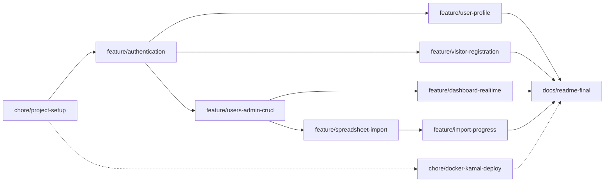

# Fullstack Developer

Rails 8 + [Inertia.js](https://inertiajs.com/) + React frontend, bundled with Vite.

## AI Disclosure

This project was built using a modern AI approach centered on spec-driven development — full
transparency below.

- **Model**: Claude Sonnet 5 (`claude-sonnet-5`), via Claude Code.
- **Scope of use**: AI was used throughout the entire development process — planning,
  implementation, and verification — not just for isolated snippets or boilerplate.
  - **Planning**: every feature branch was planned as an OpenSpec change (see `openspec/`)
    before any code was written — a proposal (why/what), a design doc (technical decisions,
    alternatives considered, risks and trade-offs), a delta spec (testable requirements), and a
    task breakdown, all reviewed and approved up front. The full history is preserved under
    `openspec/changes/archive/`.
  - **Implementation**: application code, tests, and configuration were written by the assistant
    from those approved plans, in small atomic commits. Once every commit for a change was made,
    I reviewed the resulting diffs line by line and manually tested the affected scenarios before
    considering that change complete.
  - **Verification**: the automated test suite, linter (`rubocop`), and security scanner
    (`brakeman`) were run after every change; user-facing flows were additionally smoke-tested
    end-to-end in a real browser before a branch was considered done.
- **Human role**: product and UX decisions, the reference design mockups, and final
  review/approval of every plan and commit were mine — including catching and directing fixes
  for real bugs found by reviewing the running app (e.g. a layout regression reported from a
  screenshot).

Every commit in this repository's history carries a `Co-Authored-By: Claude Sonnet 5` trailer
reflecting this.

> This README will grow as the project evolves. For now it only covers running the app locally.

## Prerequisites

* Ruby `4.0.6` (see [.ruby-version](.ruby-version))
* Node.js (any recent LTS; developed against v24)
* [Docker](https://docs.docker.com/get-docker/) + Docker Compose, for the local PostgreSQL database

## Setup

1. Install gems and JS packages:

   ```bash
   bundle install
   npm install
   ```

2. Start PostgreSQL (runs on `localhost:5432`):

   ```bash
   docker compose up -d
   ```

3. Create and migrate the databases:

   ```bash
   bin/rails db:prepare
   ```

4. Seed a couple of known-password accounts (see [Accessing the app](#accessing-the-app) below):

   ```bash
   bin/rails db:seed
   ```

## Running the app

```bash
bin/dev
```

This uses [Foreman](https://github.com/ddollar/foreman) (or `overmind`/`hivemind`, if installed) to boot everything defined in [Procfile.dev](Procfile.dev):

* `web` — Rails server
* `css` — Tailwind watcher
* `vite` — Vite dev server (serves the React/Inertia frontend)
* `jobs` — Solid Queue worker (spreadsheet imports)

The app is then available at http://localhost:3000.

## Accessing the app

`bin/rails db:seed` (above) creates two accounts, both with password `password`:

| Email | Role | Sees |
|---|---|---|
| `admin@example.com` | admin | User admin dashboard, user CRUD, spreadsheet import |
| `user@example.com` | default | Their own profile only |

A new visitor can also self-register from the sign-in page's "Sign up" link — that always
creates a `default`-role User, the same as `user@example.com` above.

## Running tests

```bash
bin/rails test
```

The test database (`umanni_test`) runs against the same Dockerized Postgres instance as development — no extra setup needed.

### System tests (Playwright)

One-time setup:

```bash
npx playwright install chromium
```

Then, since `bin/rails test` skips `test/system/` by default:

```bash
bin/rails test:system
```

## Linting & security

```bash
bin/rubocop    # Ruby style
bin/brakeman   # Ruby security scan
npm run check  # TypeScript type-check
```

## Branch & task sequencing - Initial plan

The order below tracks real dependency, not just convenience — each phase only makes sense once the previous one exists. Branches on the same level are logically independent, which matters for how PRs get sequenced even working solo, since it keeps changes atomic and reviewable.



### Base (sequential — each depends on the previous)

1. **chore/project-setup** — project scaffolding: Rails app initialization, Gemfile, Dockerfile skeleton, CI baseline. Nothing here depends on business logic, so it has to exist before anything else can build on top of it.
2. **feature/authentication** — the complete `User` model lands here, including role, migrations, and the Rails 8 authentication generator. The schema needs to be fully closed out in this branch, because the three parallel branches below inherit it without migration conflicts — changing the `User` table later, once those branches exist, is exactly the kind of thing that creates messy rebases.

### Parallel — branch off the default branch once auth is merged

3. **feature/users-admin-crud** — listing, create, edit, delete, and role toggle
4. **feature/user-profile** — view/edit/delete your own profile
5. **feature/visitor-registration** — public sign-up

These three only share one dependency: the `User` model existing with its final schema. Beyond that, they touch different controllers, views, and use cases (Admin, User, Visitor), so there's no real reason for one to block another.

### Parallel — branch off once user CRUD is merged

6. **feature/dashboard-realtime** — counters via Solid Cable
7. **feature/spreadsheet-import** — upload + Solid Queue job

Both need the user listing/CRUD to already exist (the dashboard counts users, the import creates them), but neither depends on the other — they can be developed and merged in either order.

### Sequential — depends on the import existing

8. **feature/import-progress** — progress bar via Solid Cable. This is a hard dependency: there's no import progress to broadcast until `feature/spreadsheet-import` is merged and the `SpreadsheetImport` state/job actually exists.

### Independent — can run in parallel with everything

9. **chore/docker-kamal-deploy** — doesn't depend on any business feature, only on the application skeleton existing. Worth opening early and merging incrementally as the app evolves, rather than leaving it for the end, to reduce the risk of running out of time for deployment configuration in the last days.

### Final

10. **docs/readme-final**

## Commit message convention

Commits follow [Conventional Commits](https://www.conventionalcommits.org/): `<type>: <description>`, all lowercase.

Types used in this project:

| Type | Use for |
|---|---|
| `feat` | new user-facing functionality |
| `fix` | bug fixes |
| `chore` | scaffolding, config, dependencies — no source behavior change |
| `build` | build tooling / bundler changes (Vite, asset pipeline, etc.) |
| `docs` | documentation only |
| `refactor` | code change that neither fixes a bug nor adds a feature |
| `test` | adding or fixing tests |

Example: `feat: add inertia rails for react frontend`

## Deliberate Implementation Decisions

Notes on deliberate trade-offs made in this codebase — recorded here so they read as considered
choices, not gaps.

### Input Validation

Validation in this app lives at two layers, deliberately:

- **Backend**: Rails strong params (only explicitly permitted attributes are ever read from a
  request) plus `ActiveModel`/`ActiveRecord` validations on the model itself — presence, format,
  and uniqueness on `User`, `has_secure_password`'s own password checks, and so on. Sensitive
  fields (`role`, most notably) are structurally excluded from every general-purpose params list
  rather than merely left unvalidated, so privilege escalation isn't something a validation rule
  has to catch — there's no parameter path that could set it.
- **Frontend**: Zod schemas mirror those same backend rules and validate a form as it's filled
  in, so most invalid input never reaches the server at all (see `app/javascript/schemas/`).

**What's deliberately not here**: a structural schema-validation layer on the backend (e.g.
`dry-schema`/`dry-validation`) sitting in front of `ActiveRecord`. This was considered and set
aside for this submission — not an oversight. Rails' own strong params + model validations
already give this app a real, enforced contract for every request (a field that isn't permitted
literally cannot reach the model; a field that's permitted still has to pass its validations to
be persisted), and every input path in this app is small and fully covered by tests. A dedicated
schema layer becomes more valuable as an app's input surface grows more complex than this one's
currently is — a trade-off made with that awareness, not without it.

### Explicit Side Effects Over Model Callbacks

Broadcasting an import's live progress over Action Cable (`Imports::ProgressBroadcaster`) and
the dashboard's live stats (`Dashboard::StatsBroadcaster`) are both called explicitly from the
job/controller that already changes the underlying state, not from a model callback
(`after_save`/`after_update_commit`). Models in this app stay persistence + serialization only —
a side effect like a broadcast (or a mailer) lives in its own service, invoked explicitly at the
specific call sites where it's actually meant to happen, rather than as an invisible consequence
of saving a record. Folded into a callback instead, nothing at an `import.update!(...)` call site
would hint that saving also pushes a WebSocket message, and every other future caller of
`update`/`save` on that model — a console session, a future admin action, a test — would
broadcast too, wanted or not.

### Simple, Hand-Rolled JSON Over a Serialization Layer

Every JSON shape sent to the frontend in this app is built by hand — a plain `as_json(only: [...],
methods: [...])` call on the model (`User#profile_json`, `SpreadsheetImport#summary_json`) plus a
small controller-level method for a list shape that layers on a couple of extra fields
(`users_json`, `imports_json`). There's no serialization gem doing this generically
(`ActiveModel::Serializer`, `Blueprinter`, `jsonapi-serializer`, or similar) — `jbuilder` sits in
the `Gemfile` as Rails' own default, but nothing in this app actually uses it.

It's the simplest option that works at this app's current size: every JSON shape here is small,
has exactly one caller, and is already covered by tests. A production app with meaningfully more
shapes or more reuse across endpoints would reach for a dedicated tool instead — `Blueprinter` or
similar — to keep them consistent; that's a scope call made for this submission, not a claim that
hand-rolling is how this would stay done at a larger scale.
