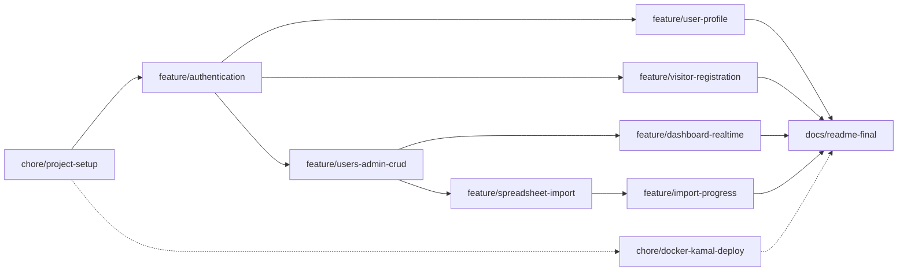

# Fullstack Developer

Rails 8 + [Inertia.js](https://inertiajs.com/) + React frontend, bundled with Vite.

## AI Disclosure

This project was built using a modern AI approach centered on spec-driven development — full
transparency below.

- **Model**: Claude Sonnet 5 (`claude-sonnet-5`), via Claude Code.
- **Scope of use**: AI was used throughout the entire development process — planning,
  implementation, and verification — not just for isolated snippets or boilerplate.
  - **Planning**: every feature branch was planned as an OpenSpec change (see `openspec/`)
    before any code was written — a proposal (why/what), a design doc (technical decisions,
    alternatives considered, risks and trade-offs), a delta spec (testable requirements), and a
    task breakdown, all reviewed and approved up front. The full history is preserved under
    `openspec/changes/archive/`.
  - **Implementation**: application code, tests, and configuration were written by the assistant
    from those approved plans, in small atomic commits. Once every commit for a change was made,
    I reviewed the resulting diffs line by line and manually tested the affected scenarios before
    considering that change complete.
  - **Verification**: the automated test suite, linter (`rubocop`), and security scanner
    (`brakeman`) were run after every change; user-facing flows were additionally smoke-tested
    end-to-end in a real browser before a branch was considered done.
- **Human role**: product and UX decisions, the reference design mockups, and final
  review/approval of every plan and commit were mine — including catching and directing fixes
  for real bugs found by reviewing the running app (e.g. a layout regression reported from a
  screenshot).

Every commit in this repository's history carries a `Co-Authored-By: Claude Sonnet 5` trailer
reflecting this.

> This README will grow as the project evolves. For now it only covers running the app locally.

## Prerequisites

* Ruby `4.0.6` (see [.ruby-version](.ruby-version))
* Node.js (any recent LTS; developed against v24)
* [Docker](https://docs.docker.com/get-docker/) + Docker Compose, for the local PostgreSQL database

## Setup

1. Install gems and JS packages:

   ```bash
   bundle install
   npm install
   ```

2. Start PostgreSQL (runs on `localhost:5432`):

   ```bash
   docker compose up -d
   ```

3. Create and migrate the databases:

   ```bash
   bin/rails db:prepare
   ```

4. Seed a couple of known-password accounts (see [Accessing the app](#accessing-the-app) below):

   ```bash
   bin/rails db:seed
   ```

## Running the app

```bash
bin/dev
```

This uses [Foreman](https://github.com/ddollar/foreman) (or `overmind`/`hivemind`, if installed) to boot everything defined in [Procfile.dev](Procfile.dev):

* `web` — Rails server
* `css` — Tailwind watcher
* `vite` — Vite dev server (serves the React/Inertia frontend)
* `jobs` — Solid Queue worker (spreadsheet imports)

The app is then available at http://localhost:3000.

## Accessing the app

`bin/rails db:seed` (above) creates two accounts, both with password `password`:

| Email | Role | Sees |
|---|---|---|
| `admin@example.com` | admin | User admin dashboard, user CRUD, spreadsheet import |
| `user@example.com` | default | Their own profile only |

A new visitor can also self-register from the sign-in page's "Sign up" link — that always
creates a `default`-role User, the same as `user@example.com` above.

## Running tests

```bash
bin/rails test
```

The test database (`umanni_test`) runs against the same Dockerized Postgres instance as development — no extra setup needed.

### System tests (Playwright)

One-time setup — installs all three of Playwright's browser engines (Chromium, Firefox, WebKit):

```bash
npx playwright install
```

Then, since `bin/rails test` skips `test/system/` by default:

```bash
bin/rails test:system
```

This runs against Chromium by default. Run the same suite against each engine with `BROWSER`:

```bash
BROWSER=chromium bin/rails test:system
BROWSER=firefox bin/rails test:system
BROWSER=webkit bin/rails test:system
```

## Linting & security

```bash
bin/rubocop    # Ruby style
bin/brakeman   # Ruby security scan
npm run check  # TypeScript type-check
```

## Branch & task sequencing - Initial plan

The order below tracks real dependency, not just convenience — each phase only makes sense once the previous one exists. Branches on the same level are logically independent, which matters for how PRs get sequenced even working solo, since it keeps changes atomic and reviewable.



### Base (sequential — each depends on the previous)

1. **chore/project-setup** — project scaffolding: Rails app initialization, Gemfile, Dockerfile skeleton, CI baseline. Nothing here depends on business logic, so it has to exist before anything else can build on top of it.
2. **feature/authentication** — the complete `User` model lands here, including role, migrations, and the Rails 8 authentication generator. The schema needs to be fully closed out in this branch, because the three parallel branches below inherit it without migration conflicts — changing the `User` table later, once those branches exist, is exactly the kind of thing that creates messy rebases.

### Parallel — branch off the default branch once auth is merged

3. **feature/users-admin-crud** — listing, create, edit, delete, and role toggle
4. **feature/user-profile** — view/edit/delete your own profile
5. **feature/visitor-registration** — public sign-up

These three only share one dependency: the `User` model existing with its final schema. Beyond that, they touch different controllers, views, and use cases (Admin, User, Visitor), so there's no real reason for one to block another.

### Parallel — branch off once user CRUD is merged

6. **feature/dashboard-realtime** — counters via Solid Cable
7. **feature/spreadsheet-import** — upload + Solid Queue job

Both need the user listing/CRUD to already exist (the dashboard counts users, the import creates them), but neither depends on the other — they can be developed and merged in either order.

### Sequential — depends on the import existing

8. **feature/import-progress** — progress bar via Solid Cable. This is a hard dependency: there's no import progress to broadcast until `feature/spreadsheet-import` is merged and the `SpreadsheetImport` state/job actually exists.

### Independent — can run in parallel with everything

9. **chore/docker-kamal-deploy** — doesn't depend on any business feature, only on the application skeleton existing. Worth opening early and merging incrementally as the app evolves, rather than leaving it for the end, to reduce the risk of running out of time for deployment configuration in the last days.

### Final

10. **docs/readme-final**

## Commit message convention

Commits follow [Conventional Commits](https://www.conventionalcommits.org/): `<type>: <description>`, all lowercase.

Types used in this project:

| Type | Use for |
|---|---|
| `feat` | new user-facing functionality |
| `fix` | bug fixes |
| `chore` | scaffolding, config, dependencies — no source behavior change |
| `build` | build tooling / bundler changes (Vite, asset pipeline, etc.) |
| `docs` | documentation only |
| `refactor` | code change that neither fixes a bug nor adds a feature |
| `test` | adding or fixing tests |

Example: `feat: add inertia rails for react frontend`

## Performance Profiling

An experiment comparing Ruby's execution modes — the plain interpreter, YJIT, and ZJIT — on this
app's own spreadsheet-import workload. Script: `script/performance/users_import_benchmark.rb`.

### Why the import pipeline

It's the one CPU-heavy, purely-Ruby workload this app actually has: parsing rows, validating
them, and building attribute hashes for thousands of records is real string/regex/hash work, not
I/O waiting. Everything else in this app (rendering a page, handling a request) is dominated by
network/DB/render time, where a Ruby JIT has little to show for itself either way.

### What's measured

`Imports::CsvParser` (parse), `Imports::RowValidator` (validate), and
`Imports::UserBatchInserter`'s own `#attributes_for` (build the Hash `User.insert_all` would
take) — the exact classes the real import job already uses, not a reimplementation. The one line
of `UserBatchInserter#call` this deliberately stops short of is `User.insert_all` itself, which
is the DB-bound part.

### Why database/network/browser work is excluded from the primary result

Because none of those are Ruby execution speed. A slower or faster Postgres round trip, network
hop, or browser render would still take roughly the same time regardless of interpreter vs. YJIT
vs. ZJIT — mixing them into the measured section would just add noise that makes it *harder*, not
easier, to see whether the execution engine matters. Excluded from the **primary** result -
there's also a secondary, opt-in end-to-end number (below) that includes real persistence, kept
clearly separate rather than blended into the same table.

### Interpreter vs. YJIT vs. ZJIT

- **Interpreter**: Ruby's default — every line is interpreted from bytecode each time it runs.
- **YJIT**: Ruby's production JIT (Shopify-originated, stable since Ruby 3.2). Compiles hot
  methods to native code at runtime, falling back to the interpreter for anything it doesn't
  handle.
- **ZJIT**: Ruby's newer, still-experimental JIT (successor design to YJIT, built on a proper
  IR/optimizer). Not part of a default Ruby build yet — needs one compiled with `--enable-zjit`
  (see "Reproducibility" below).

### How to run each

```bash
ruby script/performance/users_import_benchmark.rb            # interpreter
ruby --yjit script/performance/users_import_benchmark.rb      # YJIT
ruby --zjit script/performance/users_import_benchmark.rb      # ZJIT (only if this Ruby has it)
```

Each run saves its numbers to `tmp/performance/` (gitignored); once at least one mode has been
run, print a cross-mode comparison table from those saved files (computes nothing new, reads
only what earlier runs actually recorded):

```bash
ruby script/performance/users_import_benchmark.rb --compare
```

Also available, both opt-in and both secondary to the CPU-bound result above:

```bash
# A real Imports::UserBatchInserter#call against Postgres, wrapped in a transaction that's
# always rolled back - needs bin/rails db:seed run first (an admin User to attribute imports to).
END_TO_END=1 ruby script/performance/users_import_benchmark.rb

# ZJIT's own internal statistics for this workload (see below) - noticeably slower than plain
# --zjit (confirmed by hand), so these runs aren't saved into the comparison table at all.
ruby --zjit --zjit-stats script/performance/users_import_benchmark.rb
```

### Results

Machine: AMD Ryzen 3 3200G (4 cores), Ubuntu 24.04.4 LTS, Ruby 4.0.6, Rails 8.1.3.1, `RAILS_ENV`
unset (development default — the app just needs to boot; nothing in the measured section queries
the database). `benchmark-ips` with a 2s warmup / 5s measurement window per size (1s / 3s for the
end-to-end runs). All commands above, run in that order, on 2026-09-10.

**CPU-bound** (parse + validate + build attributes):

| Size | Interpreter | YJIT | ZJIT |
|---|---|---|---|
| 2,000 | 32.82 ms/iter | 19.94 ms/iter (+64.6%) | 25.55 ms/iter (+28.4%, −22.0% vs. YJIT) |
| 5,000 | 87.94 ms/iter | 55.15 ms/iter (+59.5%) | 63.86 ms/iter (+37.7%, −13.6% vs. YJIT) |
| 10,000 | 178.39 ms/iter | 100.33 ms/iter (+77.8%) | 135.92 ms/iter (+31.2%, −26.2% vs. YJIT) |

**End-to-end** (same parse+validate, plus a real `User.insert_all`, opt-in, rolled back):

| Size | Interpreter | YJIT | ZJIT |
|---|---|---|---|
| 2,000 | 472.97 ms/iter | 408.17 ms/iter (+15.9%) | 443.55 ms/iter (+6.6%, −8.0% vs. YJIT) |
| 5,000 | 941.28 ms/iter | 755.82 ms/iter (+24.5%) | 874.64 ms/iter (+7.6%, −13.6% vs. YJIT) |
| 10,000 | 2041.50 ms/iter | 1764.39 ms/iter (+15.7%) | 1798.86 ms/iter (+13.5%, −1.9% vs. YJIT) |

**ZJIT statistics** (`--zjit --zjit-stats`, whole-script run across all three sizes):

| Metric | Value |
|---|---|
| `compiled_iseq_count` | 930 |
| `failed_iseq_count` | 0 |
| `compile_time` | 620ms |
| `ratio_in_zjit` (instructions executed inside ZJIT-compiled code) | 70.6% |
| `side_exit_count` | 4,389,806 |
| `guard_shape_exit_ratio` | 11.1% |
| `guard_type_exit_ratio` | 0.8% |
| Top side-exit reason | `guard_shape_failure`, 73.6% of exits |
| 2nd side-exit reason | `guard_type_failure`, 26.3% of exits |

### Conclusions

- **This workload is genuinely suitable for JIT**: the CPU-bound result measures Ruby execution
  specifically (see "What's measured"), and both JITs beat the interpreter at every size, so yes
  — this workload spends enough time in actual Ruby execution for a JIT to matter.
- **YJIT provides a real, measured benefit here, and it scales with size**: +64.6% → +77.8% from
  2,000 to 10,000 rows in the CPU-bound result. More rows means more time in the same hot loop,
  which is exactly the shape of workload YJIT is built for.
- **ZJIT is also measurably faster than the interpreter (+28-38%), but consistently slower than
  YJIT** (by roughly 14-26% here) **and its advantage doesn't grow with size the way YJIT's
  does.** `ratio_in_zjit: 70.6%` shows most of the workload's instructions did run inside
  ZJIT-compiled code — so the gap to YJIT isn't "ZJIT barely engaged," it's that engaged ZJIT code
  is currently slower than engaged YJIT code for this workload. The side-exit breakdown points at
  a concrete reason: `guard_shape_failure` is 73.6% of all side exits, and
  `guard_shape_exit_ratio` is 11.1% — a real, non-trivial share of ZJIT-compiled instructions
  bail back to the interpreter on an object-shape check, `Hash`/string-heavy code (exactly what
  this workload is) being a plausible place for that to bite. That's consistent with ZJIT's own
  documented status as an experimental, less-optimized JIT relative to YJIT as of this Ruby
  version — not a claim that ZJIT is broken, just that it isn't there yet for this workload.
- **The improvement does not carry over end-to-end at anywhere near the same percentage.** The
  end-to-end numbers include one real `User.insert_all` per iteration — Postgres round-trip time
  dominates (2,000 rows: ~473ms end-to-end vs. ~33ms CPU-bound under the interpreter — the
  database write is roughly 14x the Ruby-side work it's attached to), so JIT's ~15-25%
  end-to-end improvement, while real, is mostly diluted DB time, not a 60-78% reduction in actual
  import time. **The CPU-bound row-transformation benchmark showed up to +77.8% improvement under
  YJIT. The complete import process is also affected by database persistence, so this should not
  be read as a 77.8% reduction in end-to-end import time** — the end-to-end table above is the
  honest number for that question.

### Limitations

- **bcrypt hashing is excluded from the measured section.** `UserBatchInserter#call` computes one
  `BCrypt::Password.create` per *batch* (not per row) — profiling this benchmark found that single
  call takes **~1.2 seconds** on this machine. Since it's a native C-extension crypto call
  (deliberately slow, and not something a Ruby JIT can meaningfully accelerate — YJIT/ZJIT compile
  Ruby bytecode, not `bcrypt`'s internal C loop), leaving it in the measured loop would have
  swamped and hidden any real signal from the actual Ruby-level work this benchmark targets. It's
  computed once, outside the timed section, exactly like the real code computes it once per batch.
- **Single machine, single run per mode.** No statistical run-to-run variance across separate
  invocations was collected (though `benchmark-ips`'s own within-run variance is reported above
  as `n=` iterations with its internal error margins) — a noisy shared machine could shift these
  numbers session to session.
- **CSV only.** `Imports::XlsxParser` (the other supported import format, via the `roo` gem) isn't
  benchmarked — XLSX parsing has meaningfully different CPU characteristics (XML parsing) and
  would be worth its own pass.
- **ZJIT is young.** These numbers reflect this specific Ruby 4.0.6 build's ZJIT implementation at
  this point in its development — not a permanent verdict on ZJIT versus YJIT going forward.

### Reproducibility

- **Ruby**: 4.0.6, `+PRISM`. YJIT ships enabled-by-default in this build; **ZJIT does not** — the
  Ruby distributed with this project's default toolchain (via `mise`) is built *without* ZJIT
  (`ruby --zjit -v` prints "Ruby was built without ZJIT support" and silently runs uninstrumented
  if you try anyway). Getting real ZJIT numbers required recompiling Ruby locally with ZJIT
  enabled, which itself needs a Rust toolchain (`rustc`/`cargo` — `rustup` is the simplest way to
  get both). With `mise`, add to `~/.config/mise/config.toml`:

  ```toml
  [settings.ruby]
  compile = true
  ruby_build_opts = "--enable-zjit=stats"
  ```

  then `mise uninstall ruby@4.0.6 && mise install ruby@4.0.6` to rebuild from source instead of
  fetching a precompiled binary. `bundle install` again afterward — native gem extensions
  (`bcrypt`, `pg`, ...) need rebuilding against the new Ruby binary too.
- **Rails**: 8.1.3.1.
- **OS**: Ubuntu 24.04.4 LTS, `x86_64`.
- **CPU**: AMD Ryzen 3 3200G (4 cores).
- **Commands / execution mode / env vars**: see "How to run each" above — `RAILS_ENV` unset
  (development default) for every run; `END_TO_END=1` only for the opt-in persistence runs.
- **Warm-up**: `benchmark-ips`'s own warmup phase (2s for the CPU-bound runs, 1s for end-to-end)
  before each measured window — this also absorbs one-time costs like Zeitwerk autoloading
  `Imports::CsvParser`/`RowValidator`/`UserBatchInserter` on first reference, which would
  otherwise show up as a large, non-representative first iteration.

## Open Improvements

Things this codebase doesn't do yet, named directly rather than left for someone else to find —
each with what it would actually buy.

### Input Validation

Validation in this app lives at two layers, deliberately:

- **Backend**: Rails strong params (only explicitly permitted attributes are ever read from a
  request) plus `ActiveModel`/`ActiveRecord` validations on the model itself — presence, format,
  and uniqueness on `User`, `has_secure_password`'s own password checks, and so on. Sensitive
  fields (`role`, most notably) are structurally excluded from every general-purpose params list
  rather than merely left unvalidated, so privilege escalation isn't something a validation rule
  has to catch — there's no parameter path that could set it.
- **Frontend**: Zod schemas mirror those same backend rules and validate a form as it's filled
  in, so most invalid input never reaches the server at all (see `app/javascript/schemas/`).

Adding a structural schema-validation layer (`dry-schema`/`dry-validation` or similar) in front
of `ActiveRecord` would give the backend an explicit, independent input contract of its own —
decoupled from persistence, and easier to reason about as the input surface grows.

### Simple, Hand-Rolled JSON Over a Serialization Layer

Every JSON shape sent to the frontend in this app is built by hand — a plain `as_json(only: [...],
methods: [...])` call on the model (`User#profile_json`, `SpreadsheetImport#summary_json`) plus a
small controller-level method for a list shape that layers on a couple of extra fields
(`users_json`, `imports_json`). There's no serialization gem doing this generically
(`ActiveModel::Serializer`, `Blueprinter`, `jsonapi-serializer`, or similar) — `jbuilder` sits in
the `Gemfile` as Rails' own default, but nothing in this app actually uses it.

Adopting a dedicated serialization tool (`Blueprinter` or similar) would keep JSON shapes
consistent as they grow in number or get reused across more endpoints.

### Docker Compose for the whole dev environment

Running the full stack (Rails, Vite, Solid Queue) through `docker-compose.yml`, not just
PostgreSQL, would mean no local Ruby or Node install is needed to run this app at all — anyone
could get from a clean clone to a running app with one command.

### ESLint

Adding ESLint for the React/TypeScript side would enforce hooks rules, catch unused imports, and
keep style consistent there the same way `rubocop` already does for the Ruby side.

### Encrypting more sensitive User fields

Encrypting `email_address` at rest with `ActiveRecord::Encryption` would reduce what's exposed
if the database itself were ever compromised — currently only `password_digest` gets that
protection, via `has_secure_password`'s bcrypt hashing.
