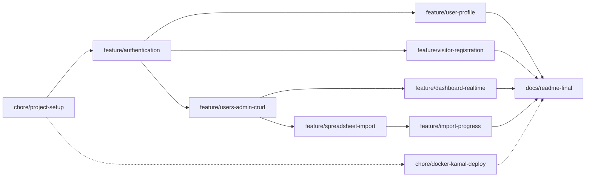

# Fullstack Developer

Rails 8 + [Inertia.js](https://inertiajs.com/) + React frontend, bundled with Vite.

## AI Disclosure

This project was built using a modern AI approach centered on spec-driven development — full
transparency below.

- **Model**: Claude Sonnet 5 (`claude-sonnet-5`), via Claude Code.
- **Scope of use**: AI was used throughout the entire development process — planning,
  implementation, and verification — not just for isolated snippets or boilerplate.
  - **Planning**: every feature branch was planned as an OpenSpec change (see `openspec/`)
    before any code was written — a proposal (why/what), a design doc (technical decisions,
    alternatives considered, risks and trade-offs), a delta spec (testable requirements), and a
    task breakdown, all reviewed and approved up front. The full history is preserved under
    `openspec/changes/archive/`.
  - **Implementation**: application code, tests, and configuration were written by the assistant
    from those approved plans, in small atomic commits. Once every commit for a change was made,
    I reviewed the resulting diffs line by line and manually tested the affected scenarios before
    considering that change complete.
  - **Verification**: the automated test suite, linter (`rubocop`), and security scanner
    (`brakeman`) were run after every change; user-facing flows were additionally smoke-tested
    end-to-end in a real browser before a branch was considered done.
- **Human role**: product and UX decisions, the reference design mockups, and final
  review/approval of every plan and commit were mine — including catching and directing fixes
  for real bugs found by reviewing the running app (e.g. a layout regression reported from a
  screenshot).

Every commit in this repository's history carries a `Co-Authored-By: Claude Sonnet 5` trailer
reflecting this.

> This README will grow as the project evolves. For now it only covers running the app locally.

## Prerequisites

* Ruby `4.0.6` (see [.ruby-version](.ruby-version))
* Node.js (any recent LTS; developed against v24)
* [Docker](https://docs.docker.com/get-docker/) + Docker Compose, for the local PostgreSQL database

## Setup

1. Install gems and JS packages:

   ```bash
   bundle install
   npm install
   ```

2. Start PostgreSQL (runs on `localhost:5432`):

   ```bash
   docker compose up -d
   ```

3. Create and migrate the databases:

   ```bash
   bin/rails db:prepare
   ```

## Running the app

```bash
bin/dev
```

This uses [Foreman](https://github.com/ddollar/foreman) (or `overmind`/`hivemind`, if installed) to boot everything defined in [Procfile.dev](Procfile.dev):

* `web` — Rails server
* `css` — Tailwind watcher
* `vite` — Vite dev server (serves the React/Inertia frontend)

The app is then available at http://localhost:3000.

## Running tests

```bash
bin/rails test
```

The test database (`umanni_test`) runs against the same Dockerized Postgres instance as development — no extra setup needed.

## Branch & task sequencing

The order below tracks real dependency, not just convenience — each phase only makes sense once the previous one exists. Branches on the same level are logically independent, which matters for how PRs get sequenced even working solo, since it keeps changes atomic and reviewable.



### Base (sequential — each depends on the previous)

1. **chore/project-setup** — project scaffolding: Rails app initialization, Gemfile, Dockerfile skeleton, CI baseline. Nothing here depends on business logic, so it has to exist before anything else can build on top of it.
2. **feature/authentication** — the complete `User` model lands here, including role, migrations, and the Rails 8 authentication generator. The schema needs to be fully closed out in this branch, because the three parallel branches below inherit it without migration conflicts — changing the `User` table later, once those branches exist, is exactly the kind of thing that creates messy rebases.

### Parallel — branch off the default branch once auth is merged

3. **feature/users-admin-crud** — listing, create, edit, delete, and role toggle
4. **feature/user-profile** — view/edit/delete your own profile
5. **feature/visitor-registration** — public sign-up

These three only share one dependency: the `User` model existing with its final schema. Beyond that, they touch different controllers, views, and use cases (Admin, User, Visitor), so there's no real reason for one to block another.

### Parallel — branch off once user CRUD is merged

6. **feature/dashboard-realtime** — counters via Solid Cable
7. **feature/spreadsheet-import** — upload + Solid Queue job

Both need the user listing/CRUD to already exist (the dashboard counts users, the import creates them), but neither depends on the other — they can be developed and merged in either order.

### Sequential — depends on the import existing

8. **feature/import-progress** — progress bar via Solid Cable. This is a hard dependency: there's no import progress to broadcast until `feature/spreadsheet-import` is merged and the `SpreadsheetImport` state/job actually exists.

### Independent — can run in parallel with everything

9. **chore/docker-kamal-deploy** — doesn't depend on any business feature, only on the application skeleton existing. Worth opening early and merging incrementally as the app evolves, rather than leaving it for the end, to reduce the risk of running out of time for deployment configuration in the last days.

### Final

10. **docs/readme-final**

## Commit message convention

Commits follow [Conventional Commits](https://www.conventionalcommits.org/): `<type>: <description>`, all lowercase.

Types used in this project:

| Type | Use for |
|---|---|
| `feat` | new user-facing functionality |
| `fix` | bug fixes |
| `chore` | scaffolding, config, dependencies — no source behavior change |
| `build` | build tooling / bundler changes (Vite, asset pipeline, etc.) |
| `docs` | documentation only |
| `refactor` | code change that neither fixes a bug nor adds a feature |
| `test` | adding or fixing tests |

Example: `feat: add inertia rails for react frontend`
